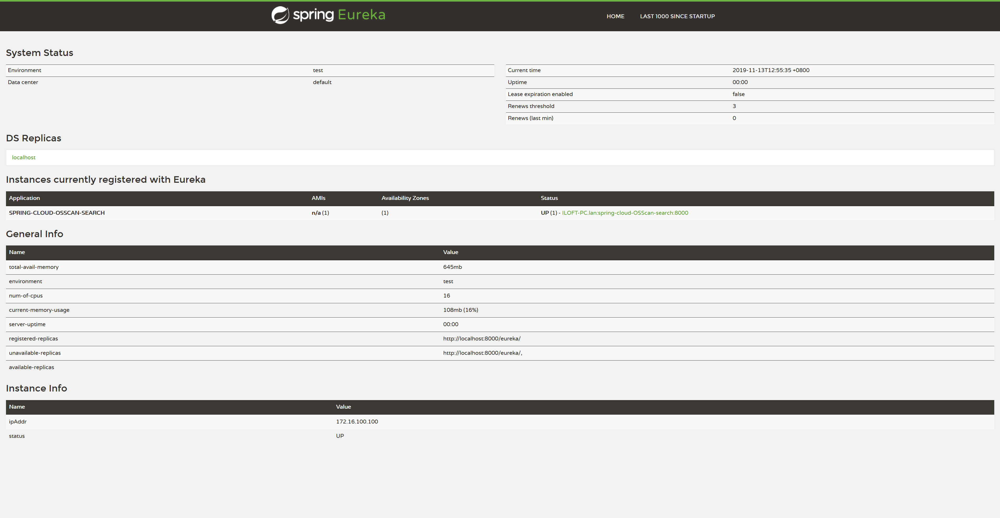

# 开源组件健康扫描 Spring Cloud Demo

　　参考以下官方 Demo 组合了一个自动注册至 Eureka 的简单的 Restful Demo。

1. [spring-cloud-netflix](https://spring.io/projects/spring-cloud-netflix)
2. [accessing-data-rest](https://spring.io/guides/gs/accessing-data-rest/)

## 功能

1. Eureka 服务自动注册
2. Restful 风格 API

## 依赖

1. Spring Cloud
   - Eureka
2. Spring Boot
   - Spring JPA
   - Spring Data REST 

## 演示

### Eureka 注册

　　启动后访问 http://localhost:8000 可以看到 Instance currently registered with Eureka 已经注册了 API。

### API 查询

　　此 DEMO 增删改查只设计数据库，不涉及具体上传下载，仅供简单参考。

#### 查询所有组件

#### 根据组件名查询

